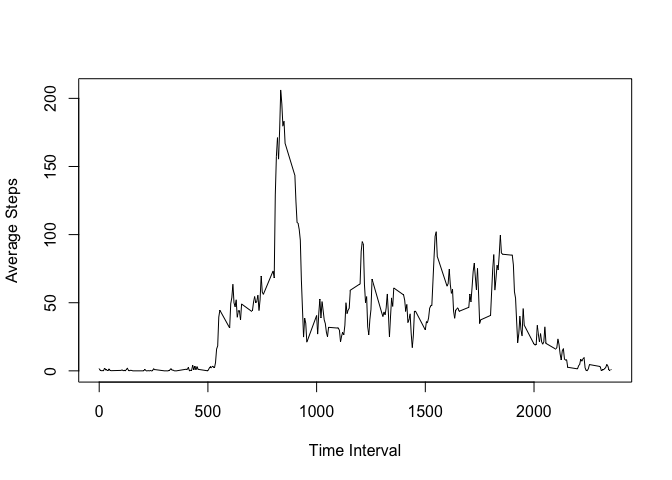
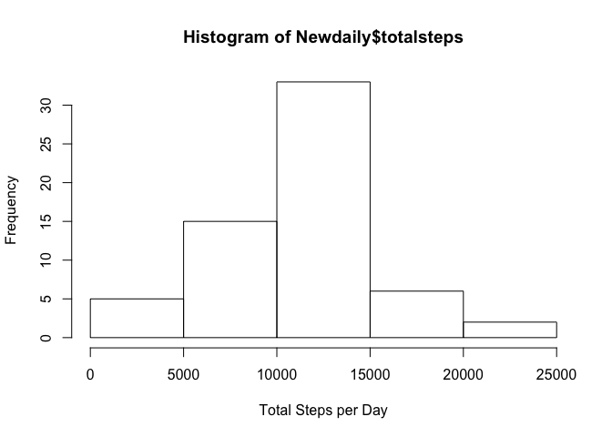
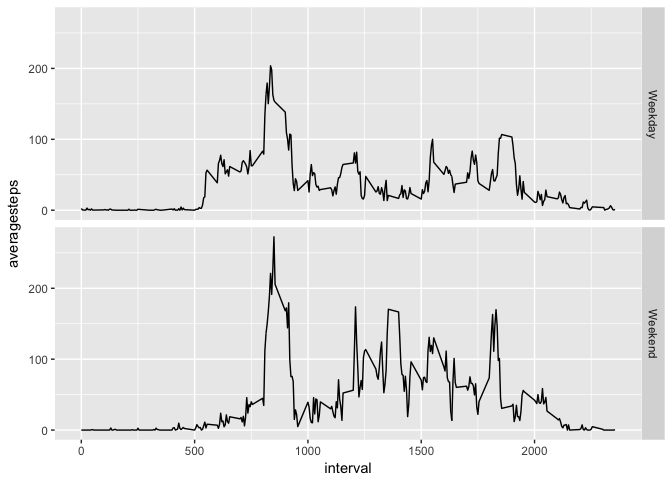

## Loading and preprocessing the data

The data is loaded
The date variable is transformed into char type for selection.
The invterval variable is transformed into char type too
1.  Load the data

```r
url <- "https://d396qusza40orc.cloudfront.net/repdata%2Fdata%2Factivity.zip"
file <- "Activity_Monitor_Data.zip"

if (!file.exists(file)) {
  download.file(url, file, mode = "wb")
}

if (!file.exists(getwd())) {
  unzip(file)
}
data<-read.csv("activity.csv")
data$date<-as.character(data$date)
```

## What is mean total number of steps taken per day?
1.  Calculate the total number of steps taken per day
2.  Make a histogram of the total number of steps taken each day

The total number taken per day is as following graph

```r
knitr::opts_chunk$set(fig.path = "figures/TotalStepswithNAs")

daily<-group_by(data,date)%>%
  summarize(totalsteps=sum(steps))
hist(daily$totalsteps,xlab="Total Steps per Day")
```

<!-- -->

```r
MeanSteps<-mean(daily$totalsteps,na.rm=TRUE)
MedianSteps<-median(daily$totalsteps,na.rm=TRUE)
```
3.  Calculate and report the mean and median of the total number of steps taken per day
The mean value of total number of steps taken per day is 1.0766189\times 10^{4}, the The median value of total number of steps taken per day is 10765

## What is the average daily activity pattern?
1.  Make a time series plot (i.e. \color{red}{\verb|type = "l"|}type="l") of the 5-minute interval (x-axis) and the average number of steps taken, averaged across all days (y-axis)

```r
knitr::opts_chunk$set(fig.path = "figures/AverageSteps")

pattern<-group_by(data,interval)%>%
  summarize(averagesteps=mean(steps,na.rm=TRUE))
plot(pattern$interval,pattern$averagesteps,type="l",
     xlab="Time Interval",ylab="Average Steps")
```

<!-- -->

2.  Which 5-minute interval, on average across all the days in the dataset, contains the maximum number of steps?

```r
MaxAverage<-pattern[pattern$averagesteps==max(pattern$averagesteps,na.rm=TRUE),1]
```
The maximum number of steps taken is at 835 to 840 interval

## Imputing missing values
1.  Calculate and report the total number of missing values in the dataset (i.e. the total number of rows with NAs

```r
Nor<-nrow(data[!complete.cases(data),])
```
There are 2304rows has NAs

2.  Devise a strategy for filling in all of the missing values in the dataset. The strategy does not need to be sophisticated. For example, you could use the mean/median for that day, or the mean for that 5-minute interval, etc.Create a new dataset that is equal to the original dataset but with the missing data filled in.

```r
data<-mutate(data,Days=factor(wday(data$date)))
pattern_temp<-group_by(data,interval,Days)%>%
  summarize(averagesteps=mean(steps,na.rm=TRUE))
NArows<-data[!complete.cases(data),]
NAtemp<-merge(NArows,pattern_temp)%>%
  select(averagesteps,date,interval,Days)%>%
  rename(steps=averagesteps)
Mess<-full_join(data,NAtemp)
```

```
## Joining, by = c("steps", "date", "interval", "Days")
```

```r
Newdata<-Mess[complete.cases(Mess),]
```
3.  Make a histogram of the total number of steps taken each day and Calculate and report the mean and median total number of steps taken per day. Do these values differ from the estimates from the first part of the assignment? What is the impact of imputing missing data on the estimates of the total daily number of steps?


```r
knitr::opts_chunk$set(fig.path = "figures/TotalStepswithoutNAs")
Newdaily<-group_by(Newdata,date)%>%
  summarize(totalsteps=sum(steps))
hist(Newdaily$totalsteps,xlab="Total Steps per Day")
```

<!-- -->

```r
NewMeanSteps<-mean(Newdaily$totalsteps,na.rm=TRUE)
NewMedianSteps<-median(Newdaily$totalsteps,na.rm=TRUE)
```
The mean value of total number of steps taken per day is 1.082121\times 10^{4}, the The median value of total number of steps taken per day is 1.1015\times 10^{4}

The author replaces the missing value with the mean value of the steps by weekday or weekend for later comparison.

From the graph, it is obvious that after replacing the missing value, both mean value and median value increases. And also, it is clear that the average steps taken is more than previous case.

## Are there differences in activity patterns between weekdays and weekends?
1.  Create a new factor variable in the dataset with two levels – “weekday” and “weekend” indicating whether a given date is a weekday or weekend day.

```r
levels(Newdata$Days)[levels(Newdata$Days)>="6"]<-"Weekend"
levels(Newdata$Days)[levels(Newdata$Days)<"6"]<-"Weekday"
```
2.  Make a panel plot containing a time series plot of the 5-minute interval (x-axis) and the average number of steps taken, averaged across all weekday days or weekend days (y-axis). See the README file in the GitHub repository to see an example of what this plot should look like using simulated data.

```r
knitr::opts_chunk$set(fig.path = "figures/ActivityComparison")

Newpattern<-group_by(Newdata,interval,Days)%>%
  summarize(averagesteps=mean(steps,na.rm=TRUE))
ggplot(Newpattern,aes(x=interval,y=averagesteps))+geom_line()+facet_grid(facets=Days ~.)
```

<!-- -->

From the graph, people are more activate on weekend even both graph shares a same pattern overall.
